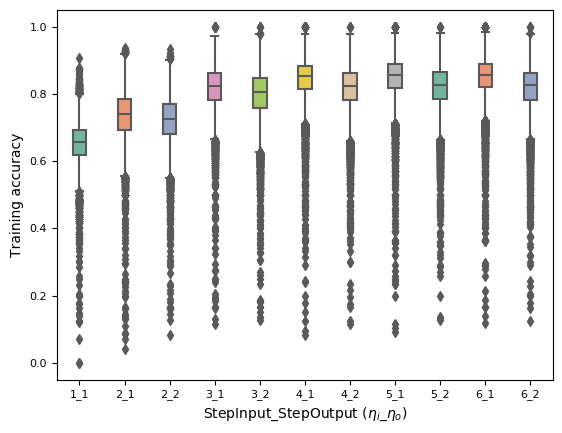

##### This folder contains experimental results on three data sets:
 
 + Helpdesk (http://dx.doi.org/10.17632/39bp3vv62t.1)
 + BPI Challenge 2012 (http://dx.doi.org/10.4121/uuid:3926db30-f712-4394-aebc-75976070e91f)
 + BPI Challenge 2017 (https://www.win.tue.nl/bpi/doku.php?id=2017:challenge)
 
 |          | Traces | Events | Average event/trace | Activity | Performer |
|----------|--------|--------|---------------------|----------|-----------|
| Helpdesk | 4580   | 21348  |               4.66  | 14       | 22        |
| BPI 2012 | 13087  | 262200 |             20.04   | 24       | 68        |
| BPI 2017 | 31509  | 1202267 |               38.1  | 26        | 149       |
 
 "**\Experimental results\Train accuracy**": This folder contains trained accuracy on different observations and number steps of input and output. 
  
 "**\Experimental results\Comparisons**": This folder contains comparison information of different accuracy on different observations.
 For example: the training accuracy on BPI 2017 data set while observing at activity as shown in the image below.
 
 
 
 "**Experimental results\Predicted networks and HRA**": This folder contains the predicted networks as well as the human resource allocation
 with these networks
 
 
