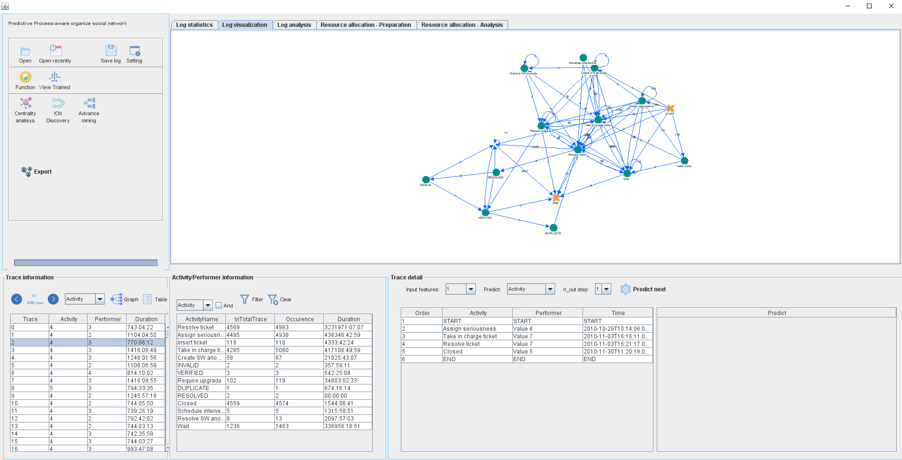
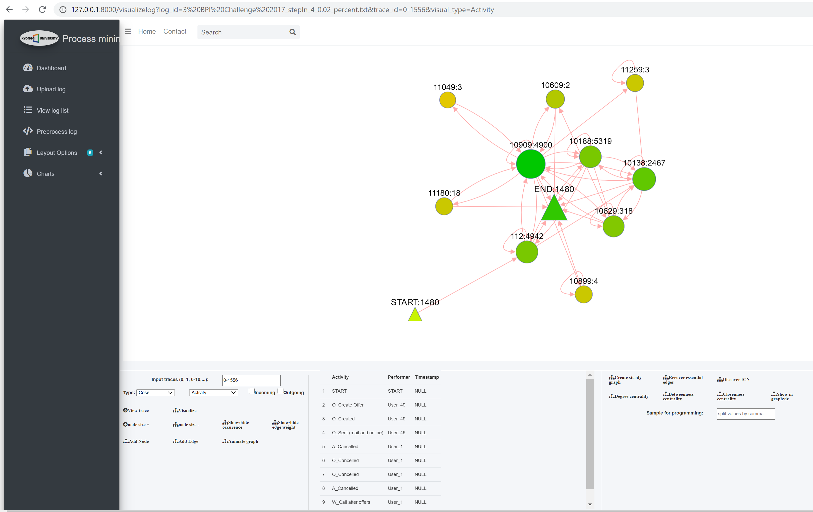

# Deep Learning-based Predictive Resource Allocation Intelligence for Process-aware Enterprises

This repository is apart of the PhD thesis entitled "Deep Learning-based Predictive Resource Allocation Intelligence for Process-aware Enterprises"

The repository is categorized as follows:
- Experimental results: This folder contains experimental results on three data sets i.e., Helpdesk, BPI 2012, and BPI 2017.
- Desktop App: This folder contains the desktop application described in the Thesis and was built by Java JDK 8. 
To run the application in your computer, please note that: 
    + Install Java JDK 8. Download it from here: https://www.oracle.com/kr/java/technologies/javase/javase-jdk8-downloads.html
    + Install MySQL database version >= 5.1. The SQL script of database is stored in folder "**Desktop App\Database**"
    + All Java source code is located in folder "**Desktop App\src**"
    + All Python source code is located in folder "**Web App**"
    + To run the application, follow the instructions in file "Desktop App\Instructions.doc" 
    
    
    Java desktop application 

- Web App: This folder contains the web application described in the Thesis and was built by Python 3.7 with Django framework and Cytoscape.JS library. 
To run the application, please note that:
    + Install the required Python packages (described in requirements.txt):
        + matplotlib==3.2.2
        + numpy==1.18.5
        + pandas==1.0.5
        + PyMySQL==0.9.3
        + Django==3.0.8
        + networkx==2.4
        + python_dateutil==2.8.1
        
     + Install MySQL database version >= 5.1. The SQL script of database is stored in folder "**Web App\Database**"
     + Run the application by using this command: `python manage.py runserver`
    
    
     
If you need any additional information, don't hesitate to contact me at _phamdinhlam (at) kyonggi dot ac dot kr_
 
